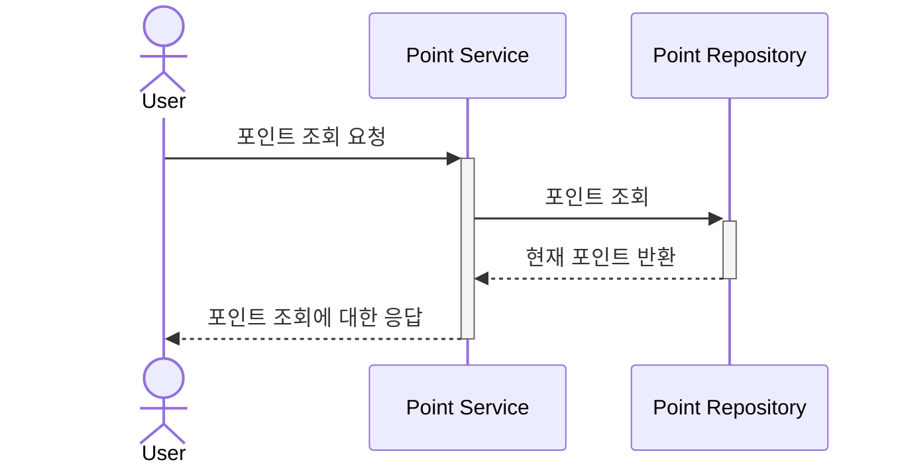
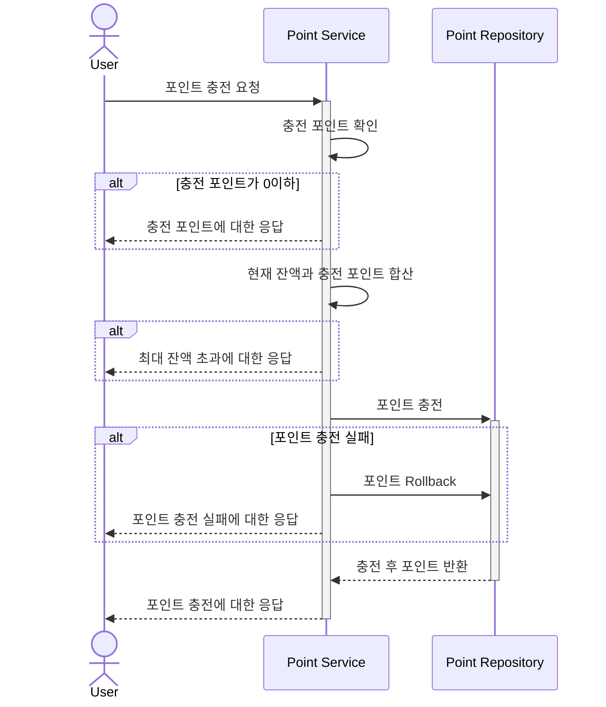
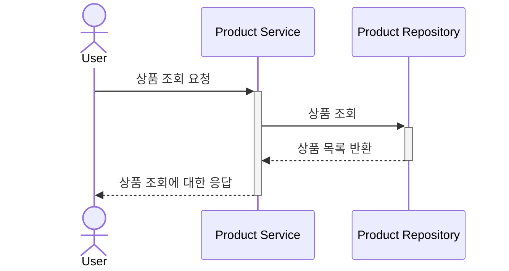
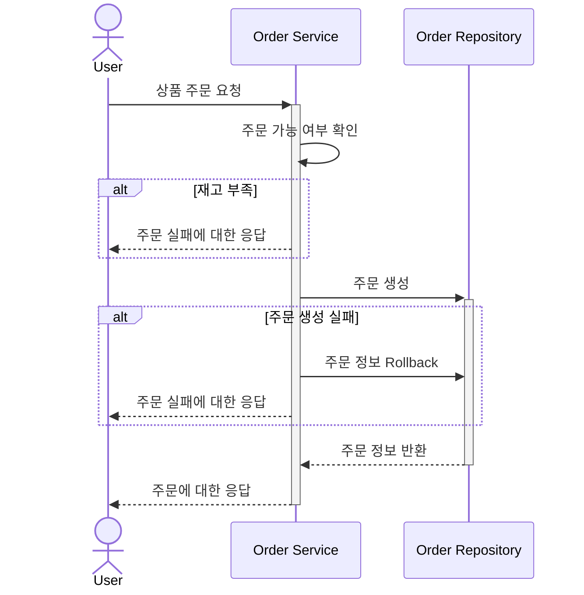
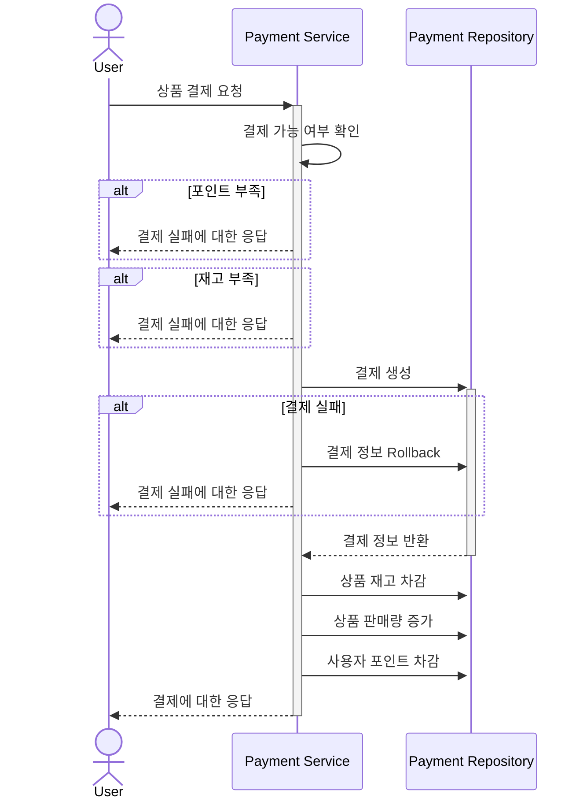

# NestJS Infrastructure Report

## Application Config

- Clean Architecture
- NestJS
- Drizzle ORM
- MySQL

## E-Commerce

### 요구사항

1. **포인트 조회**
   - 사용자는 현재 보유한 포인트를 조회할 수 있어야 한다.

2. **포인트 충전**
   - 사용자는 포인트를 충전할 수 있어야 한다.
   - 최대 충전 후 잔액은 1,000,000 포인트로 제한된다.
   - 충전할 수 있는 최대 포인트는 제한이 없다.
   - 충전할 수 있는 최소 포인트는 1 포인트이다.

3. **상품 조회**
   - 사용자는 상품을 1페이지 당 20개씩 조회할 수 있어야 한다.
   - 사용자는 판매량이 많은 상품의 상위 10개를 조회할 수 있어야 한다.

4. **상품 주문**
   - 사용자는 상품 상세 페이지에서 상품을 주문할 수 있어야 한다.
   - 주문의 필수 정보는 가격, 수량이 있다.
   - 주문 시 포인트가 충분하면 주문이 완료 후 결제 화면으로 이동된다.
   - 주문 시 포인트가 부족하면 주문할 수 없다.
   - 주문 시 상품의 재고가 없으면 주문할 수 없다.

5. **상품 결제**
   - 결제 후 포인트가 차감된다.
   - 결제 후 상품의 재고가 차감된다.
   - 결제 후 상품의 판매량이 증가된다.
   - 결제 후 주문 내역이 생성된다.

## E-Commerce

### 요구사항

1. **포인트 조회**
   - 사용자는 현재 보유한 포인트를 조회할 수 있어야 한다.

2. **포인트 충전**
   - 사용자는 포인트를 충전할 수 있어야 한다.
   - 최대 충전 후 잔액은 1,000,000 포인트로 제한된다.
   - 충전할 수 있는 최대 포인트는 제한이 없다.
   - 충전할 수 있는 최소 포인트는 1 포인트이다.

3. **상품 조회**
   - 사용자는 상품을 1페이지 당 20개씩 조회할 수 있어야 한다.
   - 사용자는 판매량이 많은 상품의 상위 10개를 조회할 수 있어야 한다.

4. **상품 주문**
   - 사용자는 상품 상세 페이지에서 상품을 주문할 수 있어야 한다.
   - 주문의 필수 정보는 가격, 수량이 있다.
   - 주문 시 상품의 재고가 없으면 주문할 수 없다.

5. **상품 결제**
   - 결제 후 포인트가 차감된다.
   - 결제 후 상품의 재고가 차감된다.
   - 결제 후 상품의 판매량이 증가된다.
   - 결제 후 주문 내역이 생성된다.
   - 포인트가 부족하면 결제에 실패한다.
   - 결제 진행 전 재고가 없으면 주문할 수 없다.

## Sequence Diagram

### 1. 포인트 조회

### 2. 포인트 충전

### 3. 상품 조회

### 4. 상품 주문
  

### 5. 상품 결제

## ERD

## API

## Transaction

## Indexing

## Caching Strategy

## Kafka

